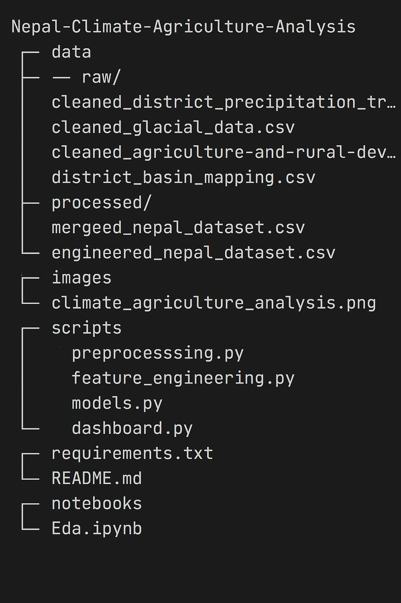

# Nepal Climate-Agriculture Analysis

## 📌 Project Overview

This project analyzes the impact of climate trends and glacial resources on agriculture in Nepal. It focuses on district-level precipitation trends, glacial data, and agricultural indicators. The pipeline includes:

- Data preprocessing
- Feature engineering
- Clustering using K-Means
- An interactive dashboard built with Streamlit

## 📁 Project Structure

## Prerequisites

- Python 3.8 or higher
- Virtual environment 

## Usage

- Run the pipeline in sequence:
- Preprocessing: python scripts/preprocessing.py
- Feature Engineering: python scripts/feature_engineering.py
- Clustering: python scripts/models.py
- Launch Dashboard: streamlit run scripts/dashboard.py
- Use the dashboard to explore relationships between climate trends, glacial resources, and agricultural indicators.

## Datasets

- Precipitation Trends: District-level seasonal trends (Winter, Monsoon, Annual).
- Glacial Data: Number and area of glaciers and glacial lakes by basin.
- Agricultural Data: Cereal yield, agricultural land, and rural population for 2020.
- District-Basin Mapping: Custom mapping of Nepal’s 75 districts to river basins.

## Acknowledgments

- Data Sources: Open Data Nepal
- Built as part of the Omdena Capstone Project.

